# ndx-extracellular-channels Extension for NWB

`ndx-extracellular-channels` is an extension of the NWB format to formally define information about neural probes as data types in NWB files. It comes with helper functions to easily construct `ndx_extracellular_channels.Probe` from `probeinterface.Probe` and vice versa.

It provides a new version of [`ElectricalSeries`](https://nwb-schema.readthedocs.io/en/latest/format.html#electricalseries) called `ExtracellularSeries`. Each `ExtracellularSeries` is associated with its own `ChannelsTable` that contains information about the channels and probe used to record the data. Each channel is mapped to contacts on the probe.

Use cases supported:
- Storing the manufacturer, model, and serial number of the probe
- Storing the size, shape, shank ID, and relative position of the contacts
- Associating a channel with a contact on a probe
- Storing multiple data streams (channels) from the same contacts on a probe, e.g., AP and LF bands from a Neuropixels probe
- Storing a selection of channels from a probe, e.g., the probe model has 960 contacts and only 384 are used
- Bipolar reference schemes, e.g., channel 1 is defined as the signal from contact 2 referenced to contact 1
- Storing precise information about the probe insertion position and orientation, separate from the targeted position and reconstructed position
- Storing separate channel tables for different data streams instead of a global channel table, which avoids creating columns that apply only to some streams
- Multiple instances of the same probe in the same file, e.g., a Neuropixels probe in the left and right hemispheres

It encompasses [SpikeInterface's `ndx-probeinterface` extension](https://github.com/SpikeInterface/ndx-probeinterface) and started originally as [@D1o0g9s's ndx-probe-interface extension](https://github.com/D1o0g9s/ndx-probe-interface).

## Installation

(TODO publish to PyPI)
```python
pip install ndx_extracellular_channels
```

## Usage

### Going from a `probeinterface.Probe`/`ProbeGroup` object to a `ndx_extracellular_channels.Probe` object
```python
import ndx_extracellular_channels

pi_probe = probeinterface.Probe(...)
pi_probegroup = probeinterface.ProbeGroup()

# from_probeinterface always returns a list of ndx_extracellular_channels.Probe devices
ndx_probes1 = ndx_extracellular_channels.from_probeinterface(pi_probe)
ndx_probes2 = ndx_extracellular_channels.from_probeinterface(pi_probegroup)

ndx_probes = ndx_probes1.extend(ndx_probes2)

nwbfile = pynwb.NWBFile(...)

# add Probe as NWB Devices
for ndx_probe in ndx_probes:
    nwbfile.add_device(ndx_probe)
```

### Going from a `ndx_extracellular_channels.Probe` object to a `probeinterface.Probe` object
```python
import ndx_extracellular_channels

# load ndx_extracellular_channels.Probe objects from NWB file
io = pynwb.NWBH5IO(file_path, "r")
nwbfile = io.read()

ndx_probes = []
for device in nwbfile:
    if isinstance(device, ndx_extracellular_channels.Probe):
        ndx_probes.append(device)

# convert to probeinterface.Probe objects
pi_probes = []
for ndx_probe in ndx_probes:
    pi_probe = ndx_extracellular_channels.to_probeinterface(ndx_probe)
    pi_probes.append(pi_probe)
```

See `src/pynwb/tests/test_example_usage_probeinterface.py` for a full example.

## Diagram

```mermaid
%%{init: {'theme': 'base', 'themeVariables': {'primaryColor': '#ffffff', "primaryBorderColor': '#144E73', 'lineColor': '#D96F32'}}}%%


classDiagram
    direction LR

    class ExtracellularSeries {
        <<ElectricalSeries>>

        channels : DynamicTableRegion
        --> target : ChannelsTable
    }

    class ChannelsTable{
        <<DynamicTable>>
        --------------------------------------
        attributes
        --------------------------------------
        name : str
        description : str
        probe : ProbeModel
        probe_insertion : ProbeInsertion, optional
        contacts : DynamicTableRegion, optional?
        --> target : ContactsTable
        reference_contact :  DynamicTableRegion, optional
        --> target : ContactsTable
        reference_mode : Literal["external wire", ...], optional

        --------------------------------------
        columns
        --------------------------------------
        id : int
        filter : VectorData, optional
        ---> Values strings such as "Bandpass 0-300 Hz".
        contact_position [x, y, z] : VectorData, optional
        ---> Each value is length 3 tuple of floats.
        brain_area : VectorData, optional
        --> data : str
        ----> Plays the role of the old 'location'.
        ... Any other custom columns, such analong frontend e.g. ADC information
    }

    class ProbeInsertion {
        <<Container>>

        insertion_position : Tuple[float, float, float], optional
        ----> Stereotactic coordinates on surface.
        depth_in_um : float, optional
        insertion_angle : Tuple[float, float, float], optional
        ----> The pitch/roll/yaw relative to the position on the surface.
    }


    namespace ProbeInterface{
        class Probe {
                <<Device>>

                identifier : str
                --> Usually the serial number
                probe_model : ProbeModel
            }

            class ProbeModel {
                <<Not sure what type>>

                name : str
                manufacturer : str
                model : str
                contour : List[Tuple[float, float], Tuple[float, float, float]]
                contact_table : ContactsTable
            }

            class ContactTable {
                <<DynamicTable>>

                --------------------------------------
                attributes
                --------------------------------------
                name : str
                description : str

                --------------------------------------
                columns
                --------------------------------------
                id : int
                shape : str, optional
                size : str, optional
                shank_id : str, optional
                relative_position : List[Tuple[float, float], Tuple[float, float, float]], optional
            }
    }



    ExtracellularSeries ..> ChannelsTable : links with channels
    ProbeModel *--> ContactTable : contains
    Probe *..> ProbeModel : links with probe_model
    ChannelsTable *..> Probe : links  with probe

    ChannelsTable ..> ContactTable : links with contacts

    ChannelsTable *--> ProbeInsertion: might contain ProbeInsertion
    note for ChannelsTable "ChannelsTable is no longer global"
```




## Ongoing work
- Publish on PyPI
- Incorporate this NDX into the core NWB schema via [NWBEP002](https://docs.google.com/document/d/1q-haFEEHEgZpRoCzzQsuSWCKN4QfMsTzLnlptLaf-yw/edit)

## Future plans
- Add information about the headstage used for data acquisition

---
This extension was created using [ndx-template](https://github.com/nwb-extensions/ndx-template).
